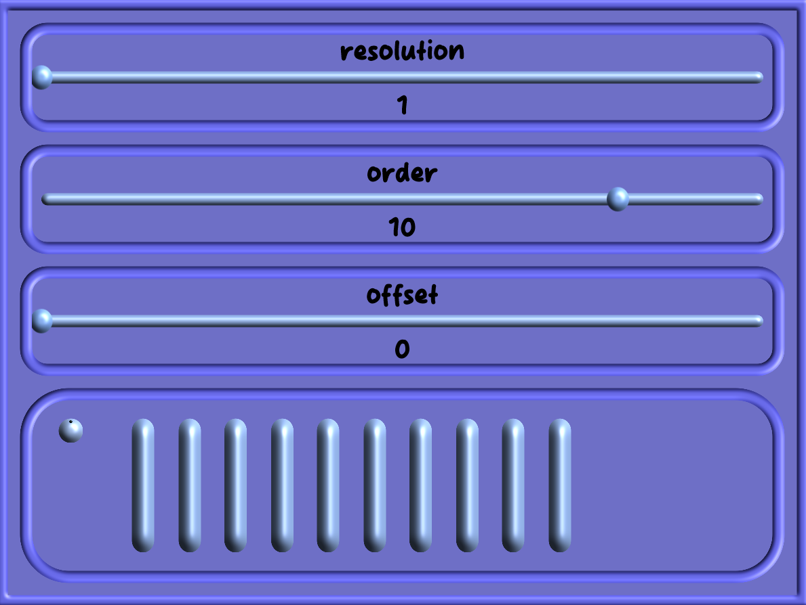

### Spectral Reduction Plugin
A VST3 plugin that implements 'spectral reduction' by quantising FFT frequency samples. You can control the number of FFT bands, the length of quantisation, and an offset of what the first quantisation sample will be.
The effect can be loaded into any DAW by downloading the VST3 file.

